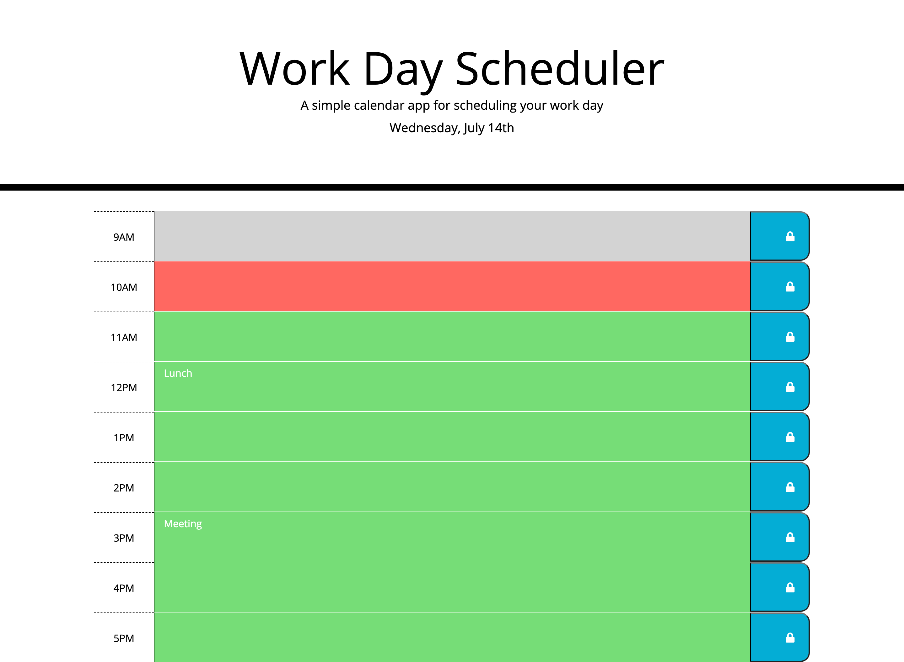

# work-day-scheduler

Scheduler that allows the user to organize and save events in timeblocks based around standard business hours.

## Functionality

* User can input events into corresponding timeblocks.

* User can save their events; events will persist when page is refreshed/reloaded.

## Features

* Utilization of jQuery, Moment JS, and Bootstrap libraries.

* Timeblocks dynamically change color based on whether they are in the past, present, or future.

* Current date in header dynamically updates.

* Utilization of local storage to save events.

## Link to Application

https://laurenlgoss.github.io/work-day-scheduler/

## Screenshot of Application

